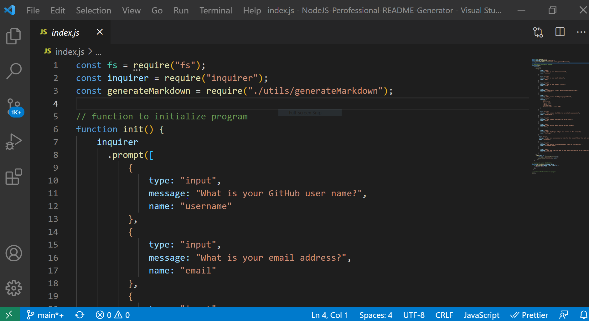
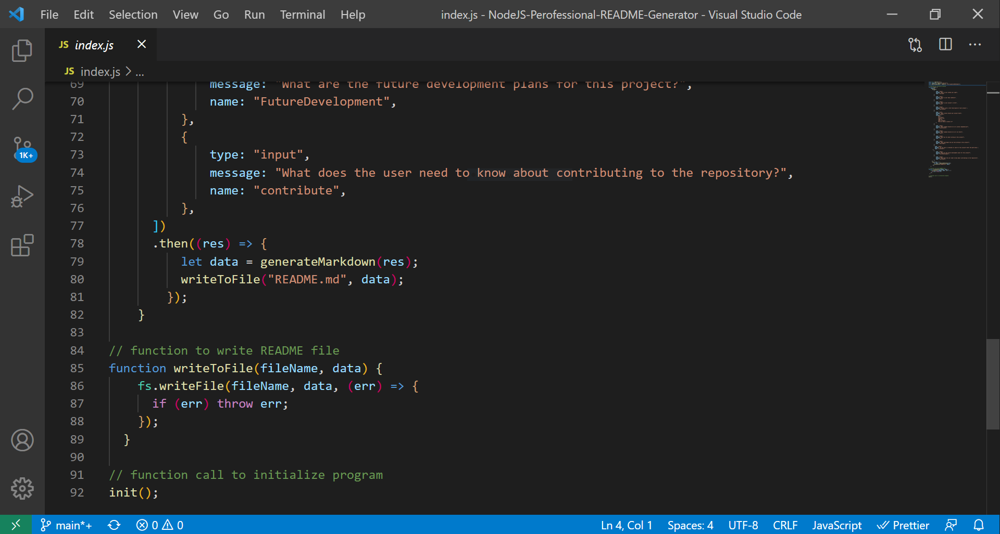

# NodeJS-Professional-README-Generator

## Description

Share My Bike is a simple Fullstack MERN APP that makes it easy to rent, post, or return a bike in your community.

## User Story

AS A developer， I want a README generator so that I can quickly create a professional README for a new project.

 

## Table of Contents

* [Usage](#usage)
* [Installation](#installation)
* [Required Dependencies](#dependencies)
* [Technologies](#technologies)
* [Tests](#tests)
* [Fun](#fun)
* [Challenges](#challenges)
* [Code Screenshot](#screenshot)
* [Finished Product](#finished-product)
* [Questions](#questions)

## Usage

GIVEN a command-line application that accepts user input

WHEN I am prompted for information about my application repository

THEN a high-quality, professional README.md is generated with the title of my project and sections entitled Description, Table of Contents, Installation, Usage, License, Contributing, Tests, and Questions.

## **Installation**

Node.js : https://nodejs.org/en/
Init and install npm : https://www.npmjs.com/get-npm

## **Required Dependencies**

Inquirer (npm install inquirer)

## Technologies

* NodeJS

## Testes

Invoke application by using the following command:

node index.js

## Fun

Coming up with different questions and playing with "Markdown Cheat Sheet".

##  Challenges

First time playing wih NodeJS, still a little confused, I definitely need to practice more.

## Code Screenshots

## Finished Product

Video walkthrough : 

## Questions

If you have any further questions, please contact me:

GitHub:https://github.com/Jamly-Miller
LinkedIn: https://www.linkedin.com/in/jamly-miller-125307200/

## Learn More

Markdown Cheat Sheet: https://www.markdownguide.org/cheat-sheet/
Npm inquirer: https://www.npmjs.com/package//inquirer